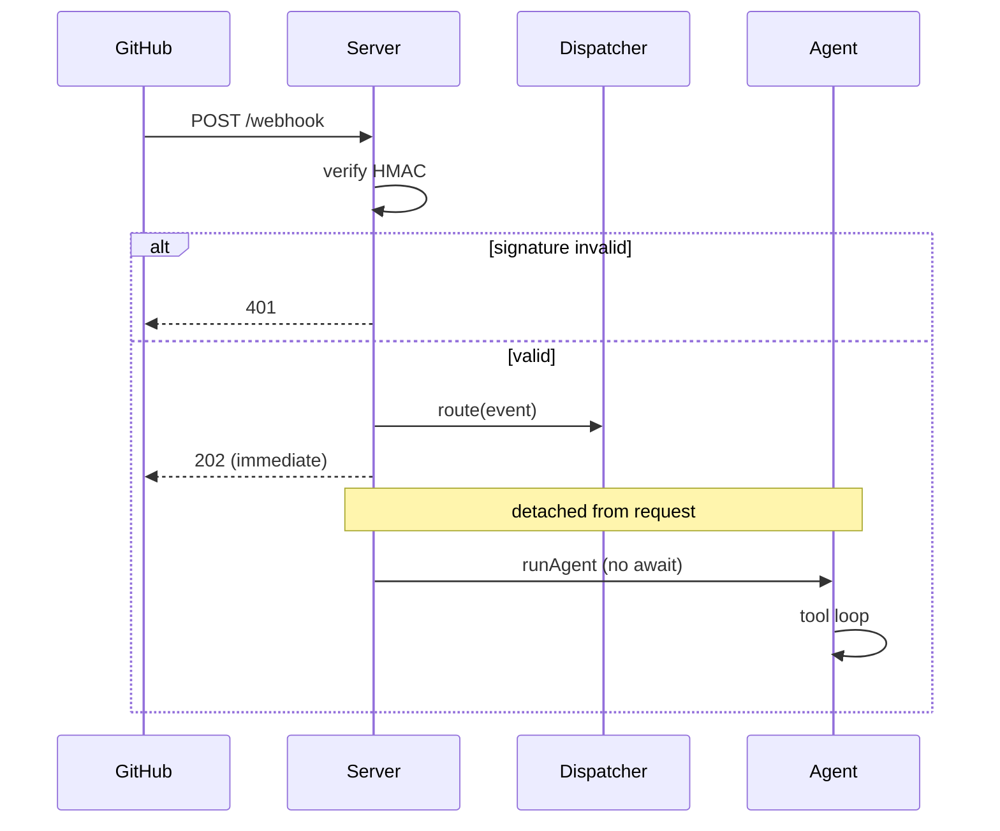

# Rubber Duck Trace

You are explaining a piece of code to a rubber duck. The duck knows nothing, never interrupts, and is unimpressed by jargon — so you have to say what the code *actually does*, in order, in plain words. That discipline is the whole point: narrating real execution step by step is how programmers find the gap between what they *think* the code does and what it *really* does. A good trace is documentation **and** a bug-finding tool at the same time.

What the trace *produces* depends on the mode the user picks (Step 2): a committable markdown file (**documentation**), an in-chat walkthrough (**explanation**), or an in-session diagnosis that points at the likely culprit (**debugging**). The engine underneath is identical in all three — an honest, anchored, execution-order trace; the mode only changes where it lands and what it emphasizes.

## The one rule that matters most

**Trace what's there, not what you assume.** Every step you write must be backed by code you actually read. If you can't find where something happens, say so — never invent a plausible-sounding step to keep the story flowing. A confident, wrong trace is worse than no trace, because it sends the reader looking in the wrong place.

This is why almost every step is anchored to a real location (`path/to/file.ts:42` or a function name). The anchor is your receipt. It also makes the doc maintainable: when the code moves, the reader knows exactly what to re-check.

**Before / after — the same step:**

> ❌ *Assumed:* "Then it validates the user's permissions and rejects unauthorized requests."
> *(Did you see permission code? Or did you just expect it to be there? This is exactly the kind of step that's wrong half the time.)*

> ✅ *Grounded:* "Then it checks `req.headers['x-signature']` against an HMAC of the body (`server.ts:31`). Note: it checks the *signature*, not the user's *role* — there's no permission check on this path. The duck would squint here."

The grounded version found a real gap. That's rubber ducking working as intended.

## Workflow

### Step 0 — Get eyes on the code

You cannot trace code you haven't read. Read the entry point and follow it outward into whatever it calls. If the code isn't available to you (no repo access, no file path, nothing pasted), ask the user for the file path or the snippet before going further. Don't trace from the name of a function alone.

### Step 1 — Find the entry point and lock the scope

The user names a *target* ("how does login work"). Your job is to turn that into a concrete **start** and **stop**.

- **Start:** the first line that runs for this story (the route handler, the `main()`, the click listener, the exported function).
- **Stop:** where the story naturally ends (a value returned to the caller, a response sent, a row written, the process exiting).

State the scope back to the user in one line *before* you write the whole thing, e.g. "I'll trace from the `POST /login` handler through to the response that goes back to the browser — that covers credential check, session creation, and the redirect. Sound right?" This catches "oh, I actually only care about the token-refresh part" before you've written 400 lines.

If the target is enormous (an entire app), don't trace everything. Pick the main **happy path**, name it explicitly, and offer to trace edge paths separately. A trace that tries to cover every branch at once reads like a tax form.

### Step 2 — Settle the approach: mode, then voice + direction

Up to three quick choices shape everything below, so settle them *before* you write a word. **Infer whatever the request already implies, and only ask what's genuinely open** — then ask the open ones together in one tappable round rather than making the user answer, wait, answer again.

**Question 1 — Mode** (what should this produce?). Usually obvious from how the request is phrased — infer it when so, ask only when unclear:

1. **Documentation** *(default when unclear)* — write the full trace to a committable markdown file (the **Output format** below). Phrases like "document…", "write up how…", "add docs for…".
2. **Explanation** — the *same* trace delivered **inline in chat**, no file. Phrases like "explain…", "walk me through…", "how does … work", "rubber duck this".
3. **Debugging** — something's wrong and the user is hunting it. Phrases like "why does … return null / fail / hang", "this should do X but does Y", "where's the bug", "help me figure out why…". **In this mode, read `references/debugging-mode.md` and follow it** — it changes the workflow (interview for the symptom *first*, then trace *toward* it and rank suspects) and the output shape. You can stop reading the rest of this step's "direction" guidance; debugging always follows the failing path top-down.
4. **Diff trace** — explain what a *change* makes the program do differently, walked in execution order with before/after at each touched step. Phrases like "trace this PR", "walk me through what this diff changes", "explain the behavior change in this commit", "what does this PR actually do at runtime". **In this mode, read `references/diff-trace-mode.md` and follow it** — it changes the workflow (read the diff *first* to lock the changed-line set) and the output shape (paired pre/post walkthrough ending in a behavioral delta).

**Question 2 — Voice** (how technical?) — applies to every mode. Offer exactly these three:

1. **Full ELI5** — assume the reader can't code at all. Metaphors over mechanics; every technical thing gets a plain-English stand-in. ("The server checks if the secret handshake matches before letting the message in.")
2. **Dev-savvy plain language** *(the usual default if they shrug)* — the reader codes but has never seen *this* codebase. Plain narrative sentences, but real terms are fine as long as each one is explained the first time it shows up. ("It verifies the HMAC — a fingerprint of the body signed with a shared secret — to prove the payload wasn't tampered with.")
3. **Match the code's complexity** — mirror the sophistication of the code itself, for a senior reader joining the project. Minimal hand-holding, still strictly sequential and narrative.

**Calibration check** — if you can't tell which voice you wrote in, re-read one paragraph and ask: how did you treat the first jargon term (say, `HMAC`, `singleton`, `monad`, `goroutine`)?

- Compared it to something from outside coding ("a fingerprint of the body," "mailing the letter to one specific clerk")? → **voice 1 (ELI5)**.
- Used the real term and gave a one-clause definition the first time ("an HMAC — a fingerprint of the body signed with a shared secret")? → **voice 2 (Dev-savvy)**.
- Used it bare, no explanation, expecting the reader to know it? → **voice 3 (Matched)**.

Pick one and stay there. Drifting between voices mid-trace is the most common reason readers bounce out — voice 2 that suddenly drops `monad` reads as if it stopped trusting them.

**Question 3 — Direction** (where does the reader's understanding start?) — documentation & explanation only; skip for debugging and diff trace (both are always top-down along the failing/changed path). Offer these two:

1. **Top-down** *(the usual default)* — start at the entry point and dive into each piece as the program reaches it. The reader follows the story from the front door inward, meeting helpers exactly when they're called. Best for "how does this whole feature work, end to end."
2. **Bottom-up** — define the small building blocks first, each as a self-contained "here's what this piece does" (in dependency order, leaves before the things that use them), *then* narrate the entry-point flow that wires them together. The reader learns the vocabulary before the plot. Best when the helpers are unfamiliar or interesting, or the code is dense with little functions you'd want defined before the story starts.

Mode picks the deliverable, voice the wording, direction the ordering. Infer the obvious ones, ask the rest in one round, and don't re-ask anything the request already answered. The honesty rule and the anchors never change regardless.

### Step 3 — Walk it (order depends on the direction they chose)

Whichever direction, you still read the code the way the computer would — functions defined at the bottom of a file might run first; imported helpers run in the middle of the story. You never narrate code in the order it's *written*. What the direction changes is where you *begin*.

**If top-down:** order the walkthrough by **what happens when**, from the entry point forward. When the flow calls a helper, narrate that helper right there, at the moment it's reached.

**If bottom-up:** first write a short **"The building blocks"** section — one small entry per leaf/helper the flow depends on, in dependency order (define a thing before the things that use it), each explaining what that piece does in isolation. Then write the **walkthrough** of the entry-point flow, which can now refer back to those pieces by name ("...then it calls `isValid` — the check we covered above — and...") instead of diving in. The assembly narration is *still* in execution order; you've just defined the parts first so the plot reads cleanly.

As you walk, watch for the four things the duck cares about most, because these are where bugs and surprises live:

- **🔀 Forks** — every `if`, `switch`, `?:`, early `return`, or `catch`. Name the condition and what each branch does. "If the cache has it, it returns immediately; otherwise it falls through to the database."
- **⚠️ Side effects** — anything that touches the outside world or shared state: DB writes, network calls, file I/O, mutating a shared object, firing an event, logging that something else depends on.
- **⏳ Async handoffs** — `await`, callbacks, promises, queues, events. Make it clear when the code *pauses and waits* versus *fires and forgets*, because that ordering is where race conditions hide.
- **🤫 Silent stuff** — swallowed errors (`catch {}`), default fallbacks, implicit type coercions, values that get quietly overwritten. These are the steps the original author forgot they wrote.

You don't need to label all four in the prose with emoji on every line — that gets noisy. Use the labels in the dedicated section (below) and mention forks/side effects inline where they're load-bearing to the story.

**In debugging mode**, you walk with a *fifth* question running alongside those four — *could this step produce the reported symptom?* — marking each step as consistent, ruled-out, or suspect. The full method (symptom interview, suspect ranking, how-to-confirm) lives in `references/debugging-mode.md`.

#### When to walk in vs summarize a call

The trace can grow without limit if you walk into every function the entry point reaches. Don't. The reader is following a *story*; every function you dive into is a parenthetical they have to remember to come back from. Use this rule:

- **Walk in** when the call carries one or more of: a fork, a side effect, an async handoff, swallowed errors, a value transformation that *matters* to the story, or a domain-playbook trap.
- **Summarize in one beat** when the call is a leaf helper that does what its name says ("`toLower(s)` lowercases the string"), a trivial wrapper that just reorders args, or a third-party library call you can't read.
- **Mention and stop** when the call leaves the code you have access to (a `fetch()` to an external service, a binding into a native library). Say "from here it hands off to `<thing>`, which I haven't traced" rather than improvising the other side.
- **Reference back, don't re-narrate** when a helper has already appeared earlier in the trace. ("Then it calls `verifySignature` again — same check as step 3.") Repetition makes the trace longer without adding information.

A useful self-check: if a step's narration is just *re-stating its name in a sentence*, you walked in for nothing — replace the dive with one summary beat and keep moving.

#### Tracing a value (data-flow), not a control path

Most traces follow what the program *does*. Some asks are really about what a *value* does — "where does this null come from", "where does `user.role` get set", "what gets done to `body` between input and the DB." That's a **data-flow trace**, and it runs in the opposite direction of a normal one:

- **Start at the value** at the moment the user is asking about — a return, an assertion failure, a row written to a DB.
- **Walk backwards** through assignments and arguments to where the value was *first set or computed*. At each step say what shape/transform the value had at that moment.
- **Branch backwards at every assignment** — if it was set in two places (conditional branches), narrate both possible origins.
- **Stop when you reach** a literal, a function parameter from outside the traced scope, or an external input (HTTP body, env var, DB read).

The output shape is the same numbered walkthrough; the steps just flow from effect back to cause. The honesty rule is *especially* load-bearing here — guessing a value's origin sends the reader hours in the wrong direction.

#### Optional: a tiny sequence diagram on top

When the trace has **3+ forks or 2+ async handoffs** (queues, fire-and-forget, parallel awaits), consider opening with a small mermaid sequence diagram so the reader sees the topology *before* reading the narrative. It's a navigation aid, not a replacement.

````markdown

````

Keep it *small* — six to ten messages, the major forks, the async-vs-sync arrow style (`->>` solid for blocking, `-->>` dashed for fire-and-forget/return). If the diagram needs more than ten lines to be honest, drop it; the prose carries the trace. Skip diagrams entirely for linear flows — they add noise.

**Domain playbooks — read one if it matches.** Those four traps are *universal*. Some kinds of code also carry their own recurring gotchas that are easy to miss unless you know to look for them — React's render/effect timing, async runtimes, message queues, query planners. If what you're tracing matches a row below, skim that playbook *before* you walk the code, so its domain-specific traps land in both your walkthrough and your "squint" section. If nothing matches, just lean on the four universal traps — most traces don't need a playbook.

| If you're tracing… | Read first |
|---|---|
| React components — renders, hooks, `useEffect`, state updates, re-render loops | `references/tracing-react.md` |
| Async JavaScript — `async`/`await`, promises, `setTimeout`, callback ordering, "why did this log out of order" | `references/tracing-async-js.md` |
| Go concurrency — goroutines (`go`), channels, `select`, `WaitGroup`, deadlocks & leaks | `references/tracing-go-concurrency.md` |
| Rust async — `async fn`, `.await`, `tokio::spawn`, `join!`/`select!`, "why didn't this run" | `references/tracing-rust-futures.md` |
| Message queues & event-driven flows — producers/consumers, brokers (Kafka/SQS/RabbitMQ), acks, retries, DLQs, duplicate/out-of-order delivery | `references/tracing-message-queues.md` |
| Tests as the target — "what does this test actually verify", "is this test load-bearing or tautological", reviewing test intent, exposing false positives | `references/tracing-tests.md` |

**Adding a playbook later:** when you catch yourself re-deriving the same domain gotchas across traces, write them down once as `references/tracing-<domain>.md` (mirror the React one's shape — mental model first, then that domain's flavor of the four traps, then a right-vs-wrong phrasing example) and add a row above. Strong candidates not yet written: SQL `EXPLAIN` plans, React Native bridges, browser layout/reflow. Don't pre-write these — only add a playbook once a real trace would have benefited from it, so each one earns its place.

### Step 4 — Deliver (depends on the mode)

- **Documentation:** save a markdown file using the **Output format** below, named after the target (`trace-login-flow.md`, `trace-order-pipeline.md`). Put it in the user's docs folder if one's obvious, otherwise where they're working — then give a **one- or two-sentence** inline recap plus the path, not a re-explanation of the whole thing. If the trace surfaced a likely bug or a genuinely surprising step, call *that* out inline ("heads up — errors in the payment step get swallowed at `checkout.ts:88`").
- **Explanation:** deliver the *same* structure **inline in chat** — drop the file and the metadata blockquote, keep the numbered walkthrough, the "where the duck would squint" list, and the one-paragraph recap. Don't write a file unless the user also asks to save it.
- **Debugging:** follow `references/debugging-mode.md` — deliver the trace inline with the prime-suspect analysis and a cheap way to confirm it. Write a file too only if the user wants the diagnosis saved.
- **Diff trace:** follow `references/diff-trace-mode.md` — deliver inline with the paired pre/post walkthrough and the behavioral-delta summary. Write a file only if the user wants it preserved alongside the PR.

## Output format

This template is the **documentation** deliverable. **Explanation** mode reuses the exact same shape inline, minus the metadata blockquote and without writing a file. **Debugging** mode uses the variant in `references/debugging-mode.md`. The duck emoji in the title is a light signature, not a mandate — if the user's existing docs are emoji-free or this is going into a formal repo, drop it (and the section-header emoji) and keep the same structure.

```markdown
# 🦆 Trace: <plain name of what's being traced>

**In one sentence:** <what this whole thing does, in language the chosen voice level would use>

> **Traced:** `<entry point>` → `<exit point>` · **Voice:** <ELI5 | Dev-savvy | Matched> · **Direction:** <Top-down | Bottom-up> · **Files:** `<main files touched>`

<!-- BOTTOM-UP ONLY: include this section only when the chosen direction is bottom-up; omit it entirely for top-down. -->
## The building blocks

The small pieces this is built from, defined before we wire them together:

- **`<helperName>`** (`path/file.ts:NN`) — <what this piece does on its own, in the chosen voice>.
- **`<helperName>`** (`path/file.ts:NN`) — <...>. (Order these so nothing is mentioned before it's defined.)

## The walkthrough

1. **It starts at `<entry>`** — `path/file.ts:NN`
   <plain narrative of the first thing that happens>

2. **Then it `<does the next thing>`** — `path/file.ts:NN`
   <narrative>. 🔀 If `<condition>`, it instead `<other path>`.

3. **Then it `<does the next thing>`** — `path/file.ts:NN`
   <narrative>. ⚠️ This writes to `<db/file/etc>` — first real side effect.

   ... (keep going, one numbered step per meaningful thing that happens) ...

N. **Finally it `<ends>`** — `path/file.ts:NN`
   <what comes out, what the caller/user/next system gets>.

## Where the duck would squint 🦆

The spots most likely to hide a bug or surprise a future reader:

- **`file.ts:NN`** — <e.g. errors here are caught and ignored; a failed write looks like success>
- **`file.ts:NN`** — <e.g. this mutates the object the caller passed in; they may not expect that>
- <only list real ones you actually found; if the code is genuinely clean, say "Nothing alarming — the path is linear and errors propagate." Don't manufacture concerns.>

## So the whole point is…

<one short paragraph, plain language, that a person could read on its own and walk away understanding the journey>
```

### Before you share it — the honesty pass

Before delivering the trace (writing the file, posting in chat), re-read the draft once with these checks. They take a minute and catch the failure modes that make traces actively misleading.

- **Every anchor resolves.** Open each `file.ts:NN` you cited and confirm the line *still says what your step claims it says*. Code moves; line numbers go stale silently. For longer traces, run `scripts/validate-anchors.py <your-trace.md> --refresh` to print the actual code at each anchor in one pass — anchors that resolve to the *wrong* line stand out immediately.
- **Order matches execution, not file layout.** Scan the step list — does it ever follow code top-to-bottom in a file instead of in run order? If yes, re-sequence.
- **Voice held throughout.** Pick a paragraph from the middle, re-read it as the chosen reader. Any jargon that should've been explained? Any metaphor that snuck in if you'd picked voice 3? Fix.
- **The squint section is honest.** Either it lists *real* risks anchored to lines you read, or it explicitly says "nothing alarming — the path is linear and errors propagate." Don't pad with vague concerns ("this could be slow," "consider caching") to fill the section.
- **Nothing past the edge of what you read.** Anywhere the trace says what a third-party lib or unread file does, confirm you read it. If you didn't, downgrade to "hands off to `<thing>`, which I haven't traced."

If any of these fail, the trace isn't ready — fix before sharing. A draft with one phantom anchor is a worse outcome than no trace at all.

### Why this shape

- **The one-sentence summary** lets someone decide in three seconds whether this is the trace they need.
- **"The building blocks"** (bottom-up only) gives the reader the vocabulary before the plot, so the walkthrough can name pieces instead of constantly diving into them.
- **The numbered walkthrough** *is* the rubber-duck narration — "first X, then Y, then Z." Numbers (not bullets) because order is the entire point.
- **The anchors** (`file.ts:NN`) keep it honest and let readers jump to the real code.
- **"Where the duck would squint"** is the debugging payoff — it's why this is a debugging method and not just a tour.
- **"So the whole point is…"** zooms back out, because after a long walkthrough people lose the forest for the trees.

## Things that quietly wreck a trace

- **Narrating the file top-to-bottom instead of in run order.** If you catch yourself describing code in the order it's *written*, stop and re-sequence by what *executes*. (Bottom-up is not an exception — its "building blocks" are ordered by dependency, and its walkthrough still runs in execution order. Neither is "read the file top to bottom.")
- **Skipping the boring glue.** "It maps the rows to DTOs" is a real step if it's where a field gets dropped. Boring-looking lines are where bugs hide.
- **Over-labeling.** Don't slap 🔀⚠️⏳🤫 on every line. Reserve the emphasis for steps that actually carry risk, or the signal stops meaning anything.
- **Drifting voice.** If they picked ELI5, "instantiates a singleton" is a failure even once. Re-read your draft as the chosen reader and fix any word they wouldn't know.
- **Guessing past the edge of what you read.** When the trail leaves the code you have (a third-party lib, an unread file), say "from here it hands off to `<thing>`, which I haven't traced" rather than improvising its insides.
- **Walking into every helper.** A trace that dives into `toLower(s)` for one beat ("it returns the lowercased string") is harder to read than one that doesn't dive in at all. Reach for the **"when to walk in vs summarize"** rule above when a call is a leaf or a trivial wrapper.
- **Phantom anchors.** Citing `file.ts:42` for a step is a *receipt*. If line 42 doesn't say what your narration claims — because the code moved, because you guessed, because you copy-pasted from an older version of the file — the receipt is forged. Run `scripts/validate-anchors.py --refresh` to spot-check on longer traces.

## Worked example

See `references/example-trace.md` for a full trace (a webhook request through signature verification into an agent dispatch) written top-down in the dev-savvy voice, plus a side-by-side of the *same* opening step in all three voices, a short illustration of how the same trace reorganizes when the user picks **bottom-up**, and — at the bottom — a **confidently wrong version of the same trace** that pattern-matches against "what servers usually do" instead of reading the code. Read all three before your first trace: the good one to calibrate the quality bar, the voice comparison to feel the level you've picked, and the anti-example to internalize what the honesty rule is actually protecting against.
